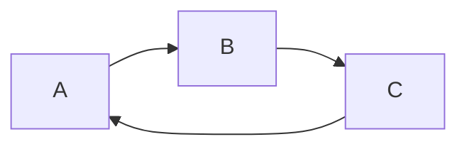

  
  
  
* content
{:toc}
  
  
  
  
## 安装Atom及卸载
  
  
- 安装
  
```
  sudo add-apt-repository ppa:webupd8team/atom
  sudo apt-get update
  sudo apt-get install atom
```
  
- 卸载
  
```
  sudo apt-get remove atom
  sudo add-apt-repository --remove ppa:webupd8team/atom
  sudo apt-get autoremove
```
  
## 插件
  
  
-> Atom
-> Preference
-> 搜索安装
  
- `simplified-chinese-menu` 中文菜单
  
- `regex-railroad-diagram` 正则表达式可视化
  
- `minimap` 缩略图
  
- `minimap-highlight-selected`
  
- `highlight-line`
  
- `atom-beautify` 自动格式化
  
  `Ctrl`-`Alt`-`B`
  
- `markdown-scroll-sync` 预览同步
  
- `git-log` 图形方式显示log
  
- `markdown-preview-enhanced` Markdown预览功能扩展
  
  https://shd101wyy.github.io/markdown-preview-enhanced/#/zh-cn/
  
## markdown-preview-enhanced
  
  
- 任务列表
  
  ```
  + [x] a
  + [x] b
  + [x] c
  + [ ] d
  ```
  
  + [x] a
  + [x] b
  + [x] c
  + [ ] d
  
- 扩展的表格
  
colspan`>`或`空单元`
  
|a|b|
|--|--|
|1||
|2||
  
rawspan`^`
  
|a|b|
|--|--|
|1|2|
|^|3|
  
- 上标与下标
  
30^th^
H~2~O
  
```
  30^th^
  H~2~O
```
  
- 脚注
  
Content [^1]
  
[^1]: Hi! This is a footnote
  
```
  Content [^1]
  
  [^1]: Hi! This is a footnote
```
  
## 数学
  
  
KaTex比MathJax更快，但少了一些MathJax的特性。
  
+ 行内公式
  
  This expression  is an example of a  inline equation.
  
  ```
    This expression $(\sqrt{3x-1}+(1+x)^2)$ is an example of a $(\LaTeX)$ inline equation.
  ```
  
+ 整行公式
  
  <p align="center"></p>
  
  ```
    $$(f(x) = \sum_{i=0}^{N}\int_{a}^{b} g(t,i) \text{ d}t{6}\tag{1})$$
  ```
  
## 画图
  
  
Markdown Preview Enhanced 内部支持`mermaid`, `PlantUML`, `WaveDrom`, `GraphViz`，`Vega & Vega-lite`，`Ditaa`图像渲染。
  
### Merimaid
  
  

  
    ```mermaid
    graph LR
      A --> B;
      B --> C;
      C --> A;
    ```
  
http://blog.csdn.net/wangyaninglm/article/details/52887045
  
  