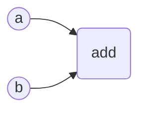
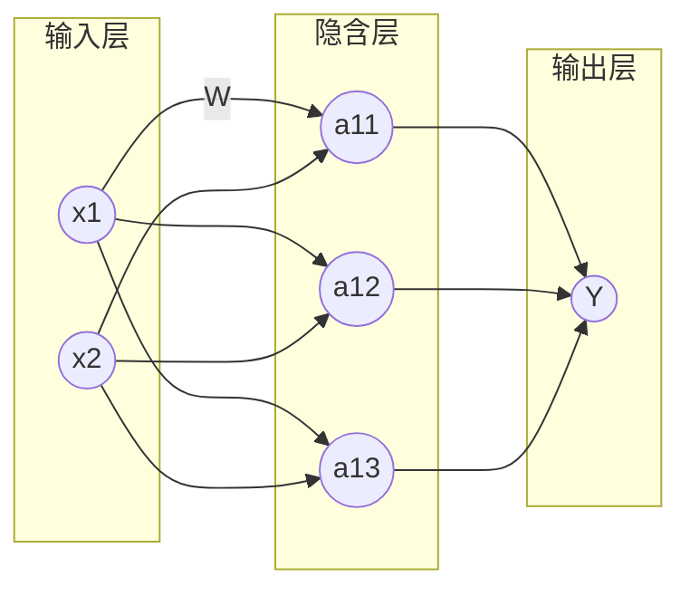

## 深度学习工具介绍和对比(2017.07)

|工具名称 |维护者|支持语言|支持系统|
|:-----:|:---:|:-----:|:----:|
|Caffe|加州大学伯克利分校视觉与学习中心|C++、Python、MATLAB|Linux、Mac OS X、 Windows|
|Deeplearning4j|Skymind|Java、Scala、Clojore|Linux、Mac OS X、 Windows、Android|
|Microsoft Congnitive Toolkit(CNTK)|微软研究院|Python、C++、BrainScript|Linux、Windows|
|MXNet|分布式机器学习社区(DMLC)|C++、Python、Julia、MATLAB、Go、R、Scala|Linux、Mac OS X、 Windows、Android、iOS|
|PaddlePaddle|百度|C++、Python|Linux、Mac OS X|
|Theano|蒙特利尔大学|Python|Linux、Mac OS X、Windows|
|TensorFlow|Google|C++、Python|Linux、Mac OS X、Windows、Android、iOS|

##  TensorFlow的计算图模型

Tensor就是张量，可以简单理解为多维数组，表示了TensorFlow的数据结构。Flow是“流”，表示TensorFlow的计算模型，体现的是张量之间通过计算相互转化的过程。

TensorFlow是一个通过计算图来描述计算过程的变成系统。TensorFlow计算图上的每一个节点代表一次计算，节点之间的边描述了计算之间的依赖关系。



每个节点代表一次运算(常量也可以理解为一次计算)，每条边表示计算之间的依赖关系，如果一个运算的输入依赖于另一个运算的输出，那么这两个运算之间有一条依赖关系。

- 在默认计算图中定义计算

  ```python
    import tensorflow as tf
    a = tf.constant([1.0, 2.0], name="a")
    b = tf.constant([2.0, 3.0], name="b")
  ```

  TensorFlow运行时系统会自动维护一个默认的计算图，可以通过`tf.get_default_graph()`获得，定义的计算会自动转化为默认计算图上的节点。

  ```python
  print(a.graph is tf.get_default_graph())
  ```

- 定义新的计算图

  通过`tf.graph()`定义新的计算图，不同计算图上的张量和运算相互独立。

- 指定计算设备

  可以通过`tf.Graph.device()`指定运行计算的设备。

  ```python
    g = tf.Graph()

    with g.device('/gpu:0'):
      result = a + b
  ```

## TensorFlowd中的张量数据模型

在TensorFlow中所有数据都通过张量的形式表示，张量可以理解为多维数组。其中零阶张量表示标量，即一个数；第一阶张量表示为向量，即一个一维数组；第n阶张量可以理解为一个n维数组。

实际上张量在TensorFlow中的实现不直接使用数组的形式，它只是对TensorFlow中运算结果的引用，张量中并不真正保存数字，它只是保存了得到这些数字的计算过程。

一个张量主要有三个属性：名字`name`，维度`shape`和类型`type`。

- 名字不仅是张量的唯一标识符，也能够表示张量如何得到。张量和计算图上节点表示的计算是对应的，张量的名字通过`node:src_output`给出，`node`为节点的名称，`src_output`是一个数字，表示该张量来自节点的第几个输出。

- 维度描述了张量的维度信息，例如`shaoe=(2,)`表示张量是一个长度为2的一维数组。

- 每个张量会有一个唯一的类型`dtype=float32`，当参与运算的张量类型不匹配时会报错。TensorFlow支持14种不同的类型，主要包括实数(`tf.float32`,`tf.float64`)、整数(`tf.int8`,`tf.in16`,`tf.in32`,`tf.int64`,`tf.unit8`)、布尔型(`tf.bool`)和复数(`tf.complex64`,`tf.complex128`)。

张量主要有两种使用方式：

- 对中间计算结果的引用，提高代码可读性。

```python
  a = tf.constant([1.0, 2.0], name="a")
```

- 当计算图构造完成后通过张量获得计算结果，用`session`可以得到张量中的具体数字。

```python
  tf.Session().run(a + b)
```

## TensorFlow的运行模型---会话 Session

### 开始和关闭会话

  会话包含了Tensorflow运行的所有资源，计算完成后需要关闭会话`tf.Session().close()`来进行资源回收。

  - 手动资源回收

  ```python
    sess = tf.Session()
    sess.run(...)
    sess.close()
  ```

  - 异常退出时自动释放资源

  ``` python
    with tf.Session() as sess:
      sess.run(...)
  ```

  - 生成会话并指定为默认。通过`tf.Tensor.eval()`计算一个张量的取值。

  ```python
    sess = tf.Session()
    with sess.as_default():
      print(result.eval())
  ```

  - 下面的两种方式可以获得相同的结果

  ```python
    sess = tf.Session()

    print(sess.run(result))
    print(result.eval(session = sess))
  ```

### 通过`ConfigProto`配置会话

通过ConfigProto可以配置并行的线程数、GPU分配策略、运算超时时间等参数。

  ```python
    config = tf.ConfigProto(allow_soft_placement = True, log_device_placement = True)
    sess1 = tf.Session(config = config)
  ```

  - `allow_soft_placement = True`当运算无法在GPU上执行时自动调整到CPU上，并适应不同数量GPU的机器。

  - `log_device_placement = True`在日志中记录每个节点被安排在哪个设备上以方便调试，设置为`False`可以减少日志量。


## TensorFlow入门

目前主流的神经网络都是分层结构，同一层的节点不会相互连接，每一层之和相邻的下一层连接，直到最后一层输出层得到计算结果。输入层和输出层之间的叫做隐藏层，隐藏层越多，这个神经网络的深度越“深”。神经网络中节点之间的联系表示了神经网络中的参数，通过对参数进行训练对神经网络进行优化，从而解决问题。

使用神经网络解决分类问题主要分为以下4步：

1. 提取特征向量作为神经网络的输入。
2. 定义神经网络的结构，如何通过前向传播算法由输入得到输出。
3. 通过训练调整神经网络中参数的取值。
4. 使用训练好的神经网络对未知的目标数据进行预测。

###　前向传播算法

神经元是神经网络的最小单元，通常由多个输入得到一个输出，其输入可以由外部输入神经网络，也可以是其他神经元的输出。一个简单的神经元的输出就是其所有输入的加权和，不同输入的权重就是神经元的参数，神经网络的优化过程就是优化神经元中参数的过程。



对于全连通的网络，其节点的值可以通过如下方式计算

$$a_{11}=W_{1,1}^{(1)}x_{1}+W_{2,1}^{(1)}x_{2}$$

前向传播算法可以表示为矩阵惩罚，将输入x1,x2组织为１ｘ２的矩阵x=[x1,x2],权重参数Ｗ组织为２ｘ３的矩阵

$$ W =\begin{bmatrix}W_{1,1}^{(1)} & W_{1,2}^{(1)} & W_{1,3}^{(1)}\\W_{2,1}^{(1)} & W_{2,2}^{(1)} & W_{2,3}^{(1)}\end{bmatrix} $$

通过矩阵乘法可以得到三个隐藏层节点组成的向量的取值：

$$ a^{(1)}=\begin{bmatrix} a_{11} & a_{12} & a_{13} \end{bmatrix}=xW^{(1)}=[x_{1},x_{2}]\begin{bmatrix}W_{1,1}^{(1)} & W_{1,2}^{(1)} & W_{1,3}^{(1)}\\W_{2,1}^{(1)} & W_{2,2}^{(1)} & W_{2,3}^{(1)}\end{bmatrix}\\=[W_{1,1}^{(1)}x_{1} +W_{2,1}^{(1)}x_{2}, W_{1,2}^{(1)}x_{1}+W_{2,2}^{(1)}x_{2},W_{1,2}^{(1)}x_{1} +W_{2,3}^{(1)}x{2}]$$

类似的输出层可以表示为：

$$ [y]=a^{(1)}W^{(2)}=[a_{11},a_{12},a_{13}]\begin{bmatrix} W_{1,1}^{(2)} \\W_{2,1}^{(2)}\\W_{3,1}^{(2)} \end{bmatrix}=[W_{1,1}^{(2)}a_{11}+W_{2,1}^{(2)}a_{12}+W_{3,1}^{(2)}a_{13}]$$

在TensorFlow用`tf.matmul`实现矩阵乘法：

```python
  a = tf.matmul(x, w1)
  y = tf.matmul(a, w2)
```
