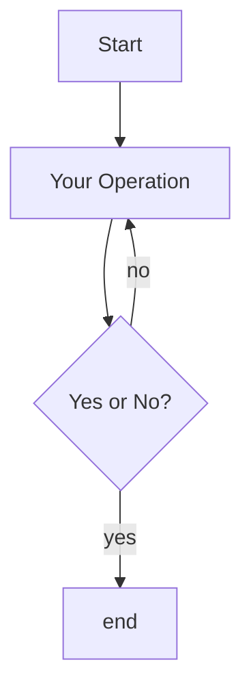

## shapely

cartopy中的形状对象是基于shapely扩展的到的,具有shapely中的方法,可以在其base类中查找.

base.area(self): 面积

base.distance(self, other): 与其他geometry的距离

base.hausdorff_distance(self, other):与其他geometry的hausdorff距离

base.length(self): 周长

base.boundary(self): Returns a lower dimension geometry that bounds the object

base.bounds: Returns minimum bounding region (minx, miny, maxx, maxy)

base.centroid(self): 几何中心

base.representative_point(self): 确保在对象内部的一个点

base.envelope(self): A figure that envelopes the geometry


### 二元运算:

base.difference(self, other): 与另一个geometry的差

base.intersection(self, other): 与另一个geometry的交

base.symmetric_difference(self, other): the symmetric difference of the geometries

base.union(self, other): 与另一个geometry的并

### 判断属性

base.has_z: 是否有z轴

base.is_empty: 是否为空图形

base.is_ring: geometry是否为闭环

base.is_closed: geometry是否封闭

base.is_simple: 如果一个geometry只有边界自相交,则为simple

base.is_valid(): 是否valid(由子类定义)

### Bool运算

base.relate(self, other): Returns the DE-9IM intersection matrix for the two geometries

base.covers(self, other): 是否覆盖了other

base.contains(self, other): 是否包含other

base.crosses(self, other): 是否cross

base.disjoint(self, other): 是否不相交

base.equals(self, other): 是否相同

base.intersects(self, other): 是否相交

base.overlaps(self, other): 是否重叠

base.touches(self, other): 是否有接触

base.within(self, other): 是否在other内部

base.equals_exact(self, other, tolerance): Returns True if geometries are equal to within a specified tolerance

base.almost_equals(self, other, decimal=6): Returns True if geometries are equal at all coordinates to a specified decimal place

base.relate_pattern(self, other, pattern): Returns True if the DE-9IM string code for the relationship between the geometries satisfies the pattern, else False




```flow
st=>start: Start
i=>inputoutput: 输入年份n
cond1=>condition: n能否被4整除？
cond2=>condition: n能否被100整除？
cond3=>condition: n能否被400整除？
o1=>inputoutput: 输出非闰年
o2=>inputoutput: 输出非闰年
o3=>inputoutput: 输出闰年
o4=>inputoutput: 输出闰年
e=>end
st->i->cond1
cond1(no)->o1->e
cond1(yes)->cond2
cond2(no)->o3->e
cond2(yes)->cond3
cond3(yes)->o2->e
cond3(no)->o4->e
```


```flow
st=>start: 开始
e=>end: End
op1=>operation: 下一个颜色
op2=>operation: 下一个图形
op3=>operation: 清空这个图形的颜色 
op4=>operation: 上一个图形
cond1=>condition: 是否满足邻接条件
cond2=>condition: 全部图形已上色
cond3=>condition: 是否还有颜色可用
cond4=>condition: 是否还有上一个图形
io1=>inputoutput: 输出找到了一个解
io2=>inputoutput: 输出没有解
st->op1->cond1
cond1(是)->cond2
cond1(否)->cond3
cond2(是)->io1->e 
cond2(否)->op2->op1
cond3(是)->op1
cond3(否)->op3->cond4
cond4(是)->op4->cond3
cond4(否)->io2->e
```