## Cartopy Gallery

### always_circular_stereo example


```python
import matplotlib.path as mpath
import matplotlib.pyplot as plt
import numpy as np

import cartopy.crs as ccrs
import cartopy.feature


def main():
    fig = plt.figure(figsize=[10, 5])
    ax1 = plt.subplot(1, 2, 1, projection=ccrs.SouthPolarStereo())
    ax2 = plt.subplot(1, 2, 2, projection=ccrs.SouthPolarStereo(),
                      sharex=ax1, sharey=ax1)
    fig.subplots_adjust(bottom=0.05, top=0.95,
                        left=0.04, right=0.95, wspace=0.02)

    # Limit the map to -60 degrees latitude and below.
    ax1.set_extent([-180, 180, -90, -60], ccrs.PlateCarree())

    ax1.add_feature(cartopy.feature.LAND)
    ax1.add_feature(cartopy.feature.OCEAN)

    ax1.gridlines()
    ax2.gridlines()

    ax2.add_feature(cartopy.feature.LAND)
    ax2.add_feature(cartopy.feature.OCEAN)

    # Compute a circle in axes coordinates, which we can use as a boundary
    # for the map. We can pan/zoom as much as we like - the boundary will be
    # permanently circular.
    theta = np.linspace(0, 2*np.pi, 100)
    center, radius = [0.5, 0.5], 0.5
    verts = np.vstack([np.sin(theta), np.cos(theta)]).T
    circle = mpath.Path(verts * radius + center)

    ax2.set_boundary(circle, transform=ax2.transAxes)

    plt.show()


if __name__ == '__main__':
    main()
```


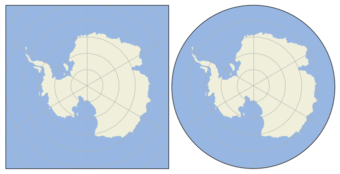


### arrows example


```python
import matplotlib.pyplot as plt
import numpy as np

import cartopy
import cartopy.crs as ccrs


def sample_data(shape=(20, 30)):
    """
    Returns ``(x, y, u, v, crs)`` of some vector data
    computed mathematically. The returned crs will be a rotated
    pole CRS, meaning that the vectors will be unevenly spaced in
    regular PlateCarree space.

    """
    crs = ccrs.RotatedPole(pole_longitude=177.5, pole_latitude=37.5)

    x = np.linspace(311.9, 391.1, shape[1])
    y = np.linspace(-23.6, 24.8, shape[0])

    x2d, y2d = np.meshgrid(x, y)
    u = 10 * (2 * np.cos(2 * np.deg2rad(x2d) + 3 * np.deg2rad(y2d + 30)) ** 2)
    v = 20 * np.cos(6 * np.deg2rad(x2d))

    return x, y, u, v, crs


def main():
    ax = plt.axes(projection=ccrs.Orthographic(-10, 45))

    ax.add_feature(cartopy.feature.OCEAN, zorder=0)
    ax.add_feature(cartopy.feature.LAND, zorder=0, edgecolor='black')

    ax.set_global()
    ax.gridlines()

    x, y, u, v, vector_crs = sample_data()
    ax.quiver(x, y, u, v, transform=vector_crs)

    plt.show()


if __name__ == '__main__':
    main()
```


### barbs example


```python
import matplotlib.pyplot as plt

import cartopy.crs as ccrs
from cartopy.examples.arrows import sample_data


def main():
    ax = plt.axes(projection=ccrs.PlateCarree())
    ax.set_extent([-90, 75, 10, 60])
    ax.stock_img()
    ax.coastlines()

    x, y, u, v, vector_crs = sample_data(shape=(10, 14))
    ax.barbs(x, y, u, v, length=5,
             sizes=dict(emptybarb=0.25, spacing=0.2, height=0.5),
             linewidth=0.95, transform=vector_crs)

    plt.show()


if __name__ == '__main__':
    main()
```


## Plotting the Aurora Forecast from NOAA on Orthographic Polar Projection


```python
"""
Plotting the Aurora Forecast from NOAA on Orthographic Polar Projection
-----------------------------------------------------------------------

The National Oceanic and Atmospheric Administration (NOAA) monitors the
solar wind conditions using the ACE spacecraft orbiting close to the L1
Lagrangian point of the Sun-Earth system. This data is fed into the
OVATION-Prime model to forecast the probability of visible aurora at
various locations on Earth. Every five minutes a new forecast is
published for the coming 30 minutes. The data is provided as a
1024 by 512 grid of probabilities in percent of visible aurora. The
data spaced equally in degrees from -180 to 180 and -90 to 90.

"""
try:
    from urllib2 import urlopen
except ImportError:
    from urllib.request import urlopen

from io import StringIO

import numpy as np
from datetime import datetime
import cartopy.crs as ccrs
import matplotlib.pyplot as plt
from matplotlib.colors import LinearSegmentedColormap
import matplotlib.patches as patches


def aurora_forecast():
    """
    Gets the latest Aurora Forecast from http://swpc.noaa.gov.

    Returns
    -------
    img : numpy array
        The pixels of the image in a numpy array.
    img_proj : cartopy CRS
        The rectangular coordinate system of the image.
    img_extent : tuple of floats
        The extent of the image ``(x0, y0, x1, y1)`` referenced in
        the ``img_proj`` coordinate system.
    origin : str
        The origin of the image to be passed through to matplotlib's imshow.
    dt : datetime
        Time of forecast validity.

    """

    # GitHub gist to download the example data from
    url = ('https://gist.githubusercontent.com/belteshassar/'
           'c7ea9e02a3e3934a9ddc/raw/aurora-nowcast-map.txt')
    # To plot the current forecast instead, uncomment the following line
    # url = 'http://services.swpc.noaa.gov/text/aurora-nowcast-map.txt'

    response_text = StringIO(urlopen(url).read().decode('utf-8'))
    img = np.loadtxt(response_text)
    # Read forecast date and time
    response_text.seek(0)
    for line in response_text:
        if line.startswith('Product Valid At:', 2):
            dt = datetime.strptime(line[-17:-1], '%Y-%m-%d %H:%M')

    img_proj = ccrs.PlateCarree()
    img_extent = (-180, 180, -90, 90)
    return img, img_proj, img_extent, 'lower', dt


def aurora_cmap():
    """Return a colormap with aurora like colors"""
    stops = {'red': [(0.00, 0.1725, 0.1725),
                     (0.50, 0.1725, 0.1725),
                     (1.00, 0.8353, 0.8353)],

             'green': [(0.00, 0.9294, 0.9294),
                       (0.50, 0.9294, 0.9294),
                       (1.00, 0.8235, 0.8235)],

             'blue': [(0.00, 0.3843, 0.3843),
                      (0.50, 0.3843, 0.3843),
                      (1.00, 0.6549, 0.6549)],

             'alpha': [(0.00, 0.0, 0.0),
                       (0.50, 1.0, 1.0),
                       (1.00, 1.0, 1.0)]}

    return LinearSegmentedColormap('aurora', stops)


def sun_pos(dt=None):
    """This function computes a rough estimate of the coordinates for
    the point on the surface of the Earth where the Sun is directly
    overhead at the time dt. Precision is down to a few degrees. This
    means that the equinoxes (when the sign of the latitude changes)
    will be off by a few days.

    The function is intended only for visualization. For more precise
    calculations consider for example the PyEphem package.

    Parameters
    ----------
        dt: datetime
            Defaults to datetime.utcnow()

    Returns
    -------
        lat, lng: tuple of floats
            Approximate coordinates of the point where the sun is
            in zenith at the time dt.
    """
    if dt is None:
        dt = datetime.utcnow()

    axial_tilt = 23.4
    ref_solstice = datetime(2016, 6, 21, 22, 22)
    days_per_year = 365.2425
    seconds_per_day = 24*60*60.0

    days_since_ref = (dt - ref_solstice).total_seconds()/seconds_per_day
    lat = axial_tilt*np.cos(2*np.pi*days_since_ref/days_per_year)
    sec_since_midnight = (dt - datetime(dt.year, dt.month, dt.day)).seconds
    lng = -(sec_since_midnight/seconds_per_day - 0.5)*360
    return lat, lng


def fill_dark_side(ax, time=None, *args, **kwargs):
    """
    Plot a fill on the dark side of the planet (without refraction).

    Parameters
    ----------
        ax : matplotlib axes
            The axes to plot on.
        time : datetime
            The time to calculate terminator for. Defaults to datetime.utcnow()
        **kwargs :
            Passed on to Matplotlib's ax.fill()

    """
    lat, lng = sun_pos(time)
    pole_lng = lng
    if lat > 0:
        pole_lat = -90 + lat
        central_rot_lng = 180
    else:
        pole_lat = 90 + lat
        central_rot_lng = 0

    rotated_pole = ccrs.RotatedPole(pole_latitude=pole_lat,
                                    pole_longitude=pole_lng,
                                    central_rotated_longitude=central_rot_lng)

    x = np.empty(360)
    y = np.empty(360)
    x[:180] = -90
    y[:180] = np.arange(-90, 90.)
    x[180:] = 90
    y[180:] = np.arange(90, -90., -1)

    ax.fill(x, y, transform=rotated_pole, **kwargs)


def main():
    fig = plt.figure(figsize=[10, 5])

    # We choose to plot in an Orthographic projection as it looks natural
    # and the distortion is relatively small around the poles where
    # the aurora is most likely.

    # ax1 for Northern Hemisphere
    ax1 = plt.subplot(1, 2, 1, projection=ccrs.Orthographic(0, 90))

    # ax2 for Southern Hemisphere
    ax2 = plt.subplot(1, 2, 2, projection=ccrs.Orthographic(180, -90))

    img, crs, extent, origin, dt = aurora_forecast()

    for ax in [ax1, ax2]:
        ax.coastlines(zorder=3)
        ax.stock_img()
        ax.gridlines()
        fill_dark_side(ax, time=dt, color='black', alpha=0.75)
        ax.imshow(img, vmin=0, vmax=100, transform=crs,
                  extent=extent, origin=origin, zorder=2,
                  cmap=aurora_cmap())

    plt.show()


if __name__ == '__main__':
    main()
```


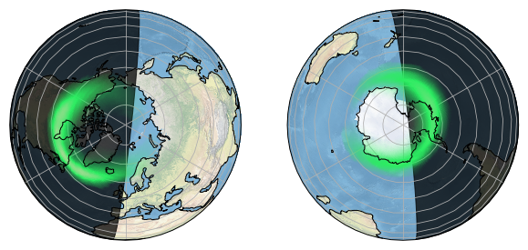


### axes_grid_basic example


```python
"""
Using Cartopy and AxesGrid toolkit
----------------------------------

This example demonstrates how to use cartopy `GeoAxes` with
`AxesGrid` from the `mpl_toolkits.axes_grid1`.
The script constructs an `axes_class` kwarg with Plate Carree projection
and passes it to the `AxesGrid` instance. The `AxesGrid` built-in
labelling is switched off, and instead a standard procedure
of creating grid lines is used. Then some fake data is plotted.
"""
import cartopy.crs as ccrs
from cartopy.mpl.geoaxes import GeoAxes
from cartopy.mpl.ticker import LongitudeFormatter, LatitudeFormatter
import matplotlib.pyplot as plt
from mpl_toolkits.axes_grid1 import AxesGrid
import numpy as np


def sample_data_3d(shape):
    """Returns `lons`, `lats`, `times` and fake `data`"""
    ntimes, nlats, nlons = shape
    lats = np.linspace(-np.pi / 2, np.pi / 2, nlats)
    lons = np.linspace(0, 2 * np.pi, nlons)
    lons, lats = np.meshgrid(lons, lats)
    wave = 0.75 * (np.sin(2 * lats) ** 8) * np.cos(4 * lons)
    mean = 0.5 * np.cos(2 * lats) * ((np.sin(2 * lats)) ** 2 + 2)

    lats = np.rad2deg(lats)
    lons = np.rad2deg(lons)
    data = wave + mean

    times = np.linspace(-1, 1, ntimes)
    new_shape = data.shape + (ntimes, )
    data = np.rollaxis(data.repeat(ntimes).reshape(new_shape), -1)
    data *= times[:, np.newaxis, np.newaxis]

    return lons, lats, times, data


def main():
    projection = ccrs.PlateCarree()
    axes_class = (GeoAxes,
                  dict(map_projection=projection))

    lons, lats, times, data = sample_data_3d((6, 73, 145))

    fig = plt.figure(figsize=(8,10))
    axgr = AxesGrid(fig, 111, axes_class=axes_class,
                    nrows_ncols=(3, 2),
                    axes_pad=0.6,
                    cbar_location='right',
                    cbar_mode='single',
                    cbar_pad=0.2,
                    cbar_size='3%',
                    label_mode='')  # note the empty label_mode

    for i, ax in enumerate(axgr):
        ax.coastlines()
        ax.set_xticks(np.linspace(-180, 180, 5), crs=projection)
        ax.set_yticks(np.linspace(-90, 90, 5), crs=projection)
        lon_formatter = LongitudeFormatter(zero_direction_label=True)
        lat_formatter = LatitudeFormatter()
        ax.xaxis.set_major_formatter(lon_formatter)
        ax.yaxis.set_major_formatter(lat_formatter)

        p = ax.contourf(lons, lats, data[i, ...],
                        transform=projection,
                        cmap='RdBu')

    axgr.cbar_axes[0].colorbar(p)

    plt.show()


if __name__ == '__main__':
    main()
```


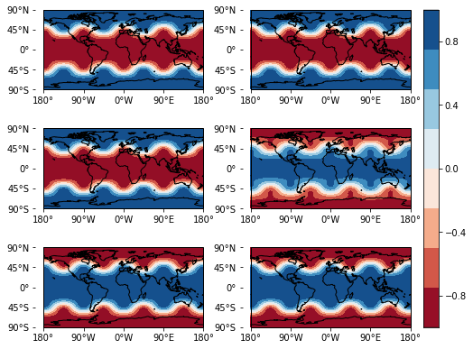


### Map tile acquisition


```python
# -*- coding: utf-8 -*-
"""
Map tile acquisition
--------------------

Demonstrates cartopy's ability to draw map tiles which are downloaded on
demand from the Stamen tile server. Internally these tiles are then combined
into a single image and displayed in the cartopy GeoAxes.

"""
import matplotlib.pyplot as plt
from matplotlib.transforms import offset_copy

import cartopy.crs as ccrs
import cartopy.io.img_tiles as cimgt


def main():
    # Create a Stamen Terrain instance.
    stamen_terrain = cimgt.StamenTerrain()

    # Create a GeoAxes in the tile's projection.
    ax = plt.axes(projection=stamen_terrain.crs)

    # Limit the extent of the map to a small longitude/latitude range.
    ax.set_extent([-22, -15, 63, 65])

    # Add the Stamen data at zoom level 8.
    ax.add_image(stamen_terrain, 8)

    # Add a marker for the Eyjafjallajökull volcano.
    plt.plot(-19.613333, 63.62, marker='o', color='red', markersize=12,
             alpha=0.7, transform=ccrs.Geodetic())

    # Use the cartopy interface to create a matplotlib transform object
    # for the Geodetic coordinate system. We will use this along with
    # matplotlib's offset_copy function to define a coordinate system which
    # translates the text by 25 pixels to the left.
    geodetic_transform = ccrs.Geodetic()._as_mpl_transform(ax)
    text_transform = offset_copy(geodetic_transform, units='dots', x=-25)

    # Add text 25 pixels to the left of the volcano.
    plt.text(-19.613333, 63.62, u'Eyjafjallajökull',
             verticalalignment='center', horizontalalignment='right',
             transform=text_transform,
             bbox=dict(facecolor='sandybrown', alpha=0.5, boxstyle='round'))
    plt.show()


if __name__ == '__main__':
    main()
```


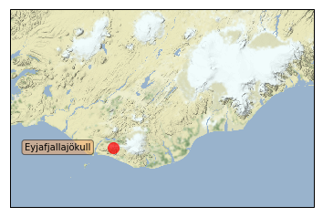


### favicon example


```python
import cartopy.crs as ccrs
import matplotlib.pyplot as plt
import matplotlib.textpath
import matplotlib.patches
from matplotlib.font_manager import FontProperties
import numpy as np


def main():
    plt.figure(figsize=[8, 8])
    ax = plt.axes(projection=ccrs.SouthPolarStereo())

    ax.coastlines()
    ax.gridlines()

    im = ax.stock_img()

    def on_draw(event=None):
        """
        Hooks into matplotlib's event mechanism to define the clip path of the
        background image.

        """
        # Clip the image to the current background boundary.
        im.set_clip_path(ax.background_patch.get_path(),
                         transform=ax.background_patch.get_transform())

    # Register the on_draw method and call it once now.
    plt.gcf().canvas.mpl_connect('draw_event', on_draw)
    on_draw()

    # Generate a matplotlib path representing the character "C".
    fp = FontProperties(family='Bitstream Vera Sans', weight='bold')
    logo_path = matplotlib.textpath.TextPath((-4.5e7, -3.7e7),
                                             'C', size=1, prop=fp)

    # Scale the letter up to an appropriate X and Y scale.
    logo_path._vertices *= np.array([103250000, 103250000])

    # Add the path as a patch, drawing black outlines around the text.
    patch = matplotlib.patches.PathPatch(logo_path, facecolor='white',
                                         edgecolor='black', linewidth=10,
                                         transform=ccrs.SouthPolarStereo())
    ax.add_patch(patch)
    plt.show()


if __name__ == '__main__':
    main()
```


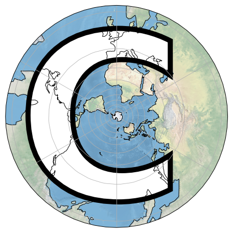


### feature_creation example


```python
import matplotlib.pyplot as plt
import cartopy.crs as ccrs
import cartopy.feature as cfeature
from matplotlib.offsetbox import AnchoredText


def main():
    fig = plt.figure(figsize=(8,8))
    ax = plt.axes(projection=ccrs.PlateCarree())
    ax.set_extent([80, 170, -45, 30])

    # Put a background image on for nice sea rendering.
    ax.stock_img()

    # Create a feature for States/Admin 1 regions at 1:50m from Natural Earth
    states_provinces = cfeature.NaturalEarthFeature(
        category='cultural',
        name='admin_1_states_provinces_lines',
        scale='50m',
        facecolor='none')

    SOURCE = 'Natural Earth'
    LICENSE = 'public domain'

    ax.add_feature(cfeature.LAND)
    ax.add_feature(cfeature.COASTLINE)
    ax.add_feature(states_provinces, edgecolor='gray')

    # Add a text annotation for the license information to the
    # the bottom right corner.
    text = AnchoredText(r'$\mathcircled{{c}}$ {}; license: {}'
                        ''.format(SOURCE, LICENSE),
                        loc=4, prop={'size': 12}, frameon=True)
    ax.add_artist(text)

    plt.show()


if __name__ == '__main__':
    main()
```


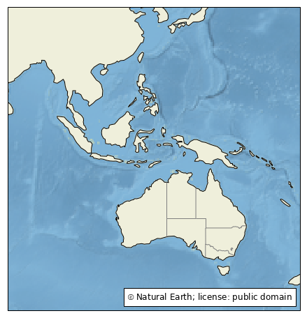


### features example


```python
import cartopy
import matplotlib.pyplot as plt


def main():
    
    fig = plt.figure(figsize=(8,8))
    ax = plt.axes(projection=cartopy.crs.PlateCarree())

    ax.add_feature(cartopy.feature.LAND)
    ax.add_feature(cartopy.feature.OCEAN)
    ax.add_feature(cartopy.feature.COASTLINE)
    ax.add_feature(cartopy.feature.BORDERS, linestyle=':')
    ax.add_feature(cartopy.feature.LAKES, alpha=0.5)
    ax.add_feature(cartopy.feature.RIVERS)

    ax.set_extent([-20, 60, -40, 40])

    plt.show()


if __name__ == '__main__':
    main()
```


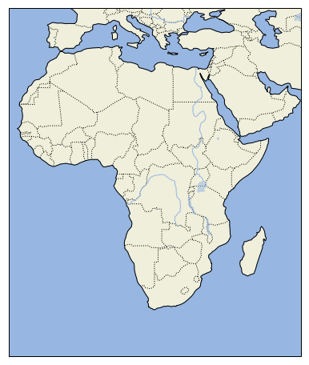


### Reprojecting images from a Geostationary projection


```python
"""
Reprojecting images from a Geostationary projection
---------------------------------------------------

This example demonstrates Cartopy's ability to project images into the desired
projection on-the-fly. The image itself is retrieved from a URL and is loaded
directly into memory without storing it intermediately into a file. It
represents pre-processed data from the Spinning Enhanced Visible and Infrared
Imager onboard Meteosat Second Generation, which has been put into an image in
the data's native Geostationary coordinate system - it is then projected by
cartopy into a global Miller map.

"""
try:
    from urllib2 import urlopen
except ImportError:
    from urllib.request import urlopen
from io import BytesIO

import cartopy.crs as ccrs
import matplotlib.pyplot as plt


def geos_image():
    """
    Return a specific SEVIRI image by retrieving it from a github gist URL.

    Returns
    -------
    img : numpy array
        The pixels of the image in a numpy array.
    img_proj : cartopy CRS
        The rectangular coordinate system of the image.
    img_extent : tuple of floats
        The extent of the image ``(x0, y0, x1, y1)`` referenced in
        the ``img_proj`` coordinate system.
    origin : str
        The origin of the image to be passed through to matplotlib's imshow.

    """
    url = ('https://gist.github.com/pelson/5871263/raw/'
           'EIDA50_201211061300_clip2.png')
    img_handle = BytesIO(urlopen(url).read())
    img = plt.imread(img_handle)
    img_proj = ccrs.Geostationary(satellite_height=35786000)
    img_extent = (-5500000, 5500000, -5500000, 5500000)
    return img, img_proj, img_extent, 'upper'


def main():
    ax = plt.axes(projection=ccrs.Miller())
    ax.coastlines()
    ax.set_global()
    img, crs, extent, origin = geos_image()
    plt.imshow(img, transform=crs, extent=extent, origin=origin, cmap='gray')
    plt.show()


if __name__ == '__main__':
    main()
```


    ---------------------------------------------------------------------------

    TimeoutError                              Traceback (most recent call last)

    ~/anaconda3/lib/python3.6/urllib/request.py in do_open(self, http_class, req, **http_conn_args)
       1317                 h.request(req.get_method(), req.selector, req.data, headers,
    -> 1318                           encode_chunked=req.has_header('Transfer-encoding'))
       1319             except OSError as err: # timeout error


    ~/anaconda3/lib/python3.6/http/client.py in request(self, method, url, body, headers, encode_chunked)
       1238         """Send a complete request to the server."""
    -> 1239         self._send_request(method, url, body, headers, encode_chunked)
       1240 


    ~/anaconda3/lib/python3.6/http/client.py in _send_request(self, method, url, body, headers, encode_chunked)
       1284             body = _encode(body, 'body')
    -> 1285         self.endheaders(body, encode_chunked=encode_chunked)
       1286 


    ~/anaconda3/lib/python3.6/http/client.py in endheaders(self, message_body, encode_chunked)
       1233             raise CannotSendHeader()
    -> 1234         self._send_output(message_body, encode_chunked=encode_chunked)
       1235 


    ~/anaconda3/lib/python3.6/http/client.py in _send_output(self, message_body, encode_chunked)
       1025         del self._buffer[:]
    -> 1026         self.send(msg)
       1027 


    ~/anaconda3/lib/python3.6/http/client.py in send(self, data)
        963             if self.auto_open:
    --> 964                 self.connect()
        965             else:


    ~/anaconda3/lib/python3.6/http/client.py in connect(self)
       1391 
    -> 1392             super().connect()
       1393 


    ~/anaconda3/lib/python3.6/http/client.py in connect(self)
        935         self.sock = self._create_connection(
    --> 936             (self.host,self.port), self.timeout, self.source_address)
        937         self.sock.setsockopt(socket.IPPROTO_TCP, socket.TCP_NODELAY, 1)


    ~/anaconda3/lib/python3.6/socket.py in create_connection(address, timeout, source_address)
        721     if err is not None:
    --> 722         raise err
        723     else:


    ~/anaconda3/lib/python3.6/socket.py in create_connection(address, timeout, source_address)
        712                 sock.bind(source_address)
    --> 713             sock.connect(sa)
        714             return sock


    TimeoutError: [Errno 110] Connection timed out

    
    During handling of the above exception, another exception occurred:


    URLError                                  Traceback (most recent call last)

    <ipython-input-19-925c419a9f62> in <module>()
         58 
         59 if __name__ == '__main__':
    ---> 60     main()
    

    <ipython-input-19-925c419a9f62> in main()
         52     ax.coastlines()
         53     ax.set_global()
    ---> 54     img, crs, extent, origin = geos_image()
         55     plt.imshow(img, transform=crs, extent=extent, origin=origin, cmap='gray')
         56     plt.show()


    <ipython-input-19-925c419a9f62> in geos_image()
         41     url = ('https://gist.github.com/pelson/5871263/raw/'
         42            'EIDA50_201211061300_clip2.png')
    ---> 43     img_handle = BytesIO(urlopen(url).read())
         44     img = plt.imread(img_handle)
         45     img_proj = ccrs.Geostationary(satellite_height=35786000)


    ~/anaconda3/lib/python3.6/urllib/request.py in urlopen(url, data, timeout, cafile, capath, cadefault, context)
        221     else:
        222         opener = _opener
    --> 223     return opener.open(url, data, timeout)
        224 
        225 def install_opener(opener):


    ~/anaconda3/lib/python3.6/urllib/request.py in open(self, fullurl, data, timeout)
        524             req = meth(req)
        525 
    --> 526         response = self._open(req, data)
        527 
        528         # post-process response


    ~/anaconda3/lib/python3.6/urllib/request.py in _open(self, req, data)
        542         protocol = req.type
        543         result = self._call_chain(self.handle_open, protocol, protocol +
    --> 544                                   '_open', req)
        545         if result:
        546             return result


    ~/anaconda3/lib/python3.6/urllib/request.py in _call_chain(self, chain, kind, meth_name, *args)
        502         for handler in handlers:
        503             func = getattr(handler, meth_name)
    --> 504             result = func(*args)
        505             if result is not None:
        506                 return result


    ~/anaconda3/lib/python3.6/urllib/request.py in https_open(self, req)
       1359         def https_open(self, req):
       1360             return self.do_open(http.client.HTTPSConnection, req,
    -> 1361                 context=self._context, check_hostname=self._check_hostname)
       1362 
       1363         https_request = AbstractHTTPHandler.do_request_


    ~/anaconda3/lib/python3.6/urllib/request.py in do_open(self, http_class, req, **http_conn_args)
       1318                           encode_chunked=req.has_header('Transfer-encoding'))
       1319             except OSError as err: # timeout error
    -> 1320                 raise URLError(err)
       1321             r = h.getresponse()
       1322         except:


    URLError: <urlopen error [Errno 110] Connection timed out>


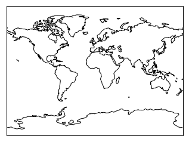


### global_map example


```python
import matplotlib.pyplot as plt

import cartopy.crs as ccrs


def main():
    fig = plt.figure(figsize=(8,8))
    ax = plt.axes(projection=ccrs.Robinson())

    # make the map global rather than have it zoom in to
    # the extents of any plotted data
    ax.set_global()

    ax.stock_img()
    ax.coastlines()

    plt.plot(-0.08, 51.53, 'o', transform=ccrs.PlateCarree())
    plt.plot([-0.08, 132], [51.53, 43.17], transform=ccrs.PlateCarree())
    plt.plot([-0.08, 132], [51.53, 43.17], transform=ccrs.Geodetic())

    plt.show()


if __name__ == '__main__':
    main()
```


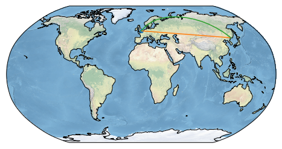


### hurricane_katrina example


```python
import matplotlib.patches as mpatches
import matplotlib.pyplot as plt
import shapely.geometry as sgeom

import cartopy.crs as ccrs
import cartopy.io.shapereader as shpreader


def sample_data():
    """
    Returns a list of latitudes and a list of longitudes (lons, lats)
    for Hurricane Katrina (2005).

    The data was originally sourced from the HURDAT2 dataset from AOML/NOAA:
    http://www.aoml.noaa.gov/hrd/hurdat/newhurdat-all.html on 14th Dec 2012.

    """
    lons = [-75.1, -75.7, -76.2, -76.5, -76.9, -77.7, -78.4, -79.0,
            -79.6, -80.1, -80.3, -81.3, -82.0, -82.6, -83.3, -84.0,
            -84.7, -85.3, -85.9, -86.7, -87.7, -88.6, -89.2, -89.6,
            -89.6, -89.6, -89.6, -89.6, -89.1, -88.6, -88.0, -87.0,
            -85.3, -82.9]

    lats = [23.1, 23.4, 23.8, 24.5, 25.4, 26.0, 26.1, 26.2, 26.2, 26.0,
            25.9, 25.4, 25.1, 24.9, 24.6, 24.4, 24.4, 24.5, 24.8, 25.2,
            25.7, 26.3, 27.2, 28.2, 29.3, 29.5, 30.2, 31.1, 32.6, 34.1,
            35.6, 37.0, 38.6, 40.1]

    return lons, lats


def main():
    ax = plt.axes([0, 0, 1, 1],
                  projection=ccrs.LambertConformal())

    ax.set_extent([-125, -66.5, 20, 50], ccrs.Geodetic())

    shapename = 'admin_1_states_provinces_lakes_shp'
    states_shp = shpreader.natural_earth(resolution='110m',
                                         category='cultural', name=shapename)

    lons, lats = sample_data()

    # to get the effect of having just the states without a map "background"
    # turn off the outline and background patches
    ax.background_patch.set_visible(False)
    ax.outline_patch.set_visible(False)

    plt.title('US States which intersect the track '
              'of Hurricane Katrina (2005)')

    # turn the lons and lats into a shapely LineString
    track = sgeom.LineString(zip(lons, lats))

    # buffer the linestring by two degrees (note: this is a non-physical
    # distance)
    track_buffer = track.buffer(2)

    for state in shpreader.Reader(states_shp).geometries():
        # pick a default color for the land with a black outline,
        # this will change if the storm intersects with our track
        facecolor = [0.9375, 0.9375, 0.859375]
        edgecolor = 'black'

        if state.intersects(track):
            facecolor = 'red'
        elif state.intersects(track_buffer):
            facecolor = '#FF7E00'

        ax.add_geometries([state], ccrs.PlateCarree(),
                          facecolor=facecolor, edgecolor=edgecolor)

    ax.add_geometries([track_buffer], ccrs.PlateCarree(),
                      facecolor='#C8A2C8', alpha=0.5)
    ax.add_geometries([track], ccrs.PlateCarree(),
                      facecolor='none',  edgecolor='green')

    # make two proxy artists to add to a legend
    direct_hit = mpatches.Rectangle((0, 0), 1, 1, facecolor="red")
    within_2_deg = mpatches.Rectangle((0, 0), 1, 1, facecolor="#FF7E00")
    labels = ['State directly intersects\nwith track',
              'State is within \n2 degrees of track']
    plt.legend([direct_hit, within_2_deg], labels,
               loc='lower left', bbox_to_anchor=(0.025, -0.1), fancybox=True)

    plt.show()


if __name__ == '__main__':
    main()
```


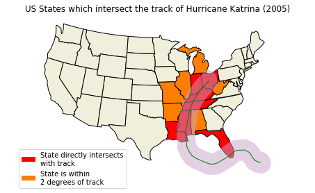


### image_tiles example


```python
"""
Web tile imagery
----------------

This example demonstrates how imagery from a tile
providing web service can be accessed.

"""
import matplotlib.pyplot as plt

from cartopy.io.img_tiles import StamenTerrain


def main():
    tiler = StamenTerrain()
    mercator = tiler.crs
    fig = plt.figure(figsize=(8,8))
    ax = plt.axes(projection=mercator)
    ax.set_extent([-90, -73, 22, 34])

    ax.add_image(tiler, 6)

    ax.coastlines('10m')
    plt.show()


if __name__ == '__main__':
    main()
```


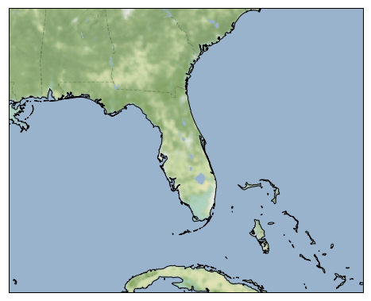


### logo example


```python
import cartopy.crs as ccrs
import matplotlib.pyplot as plt
import matplotlib.textpath
import matplotlib.patches
from matplotlib.font_manager import FontProperties
import numpy as np


def main():
    plt.figure(figsize=[12, 6])
    ax = plt.axes(projection=ccrs.Robinson())

    ax.coastlines()
    ax.gridlines()

    # generate a matplotlib path representing the word "cartopy"
    fp = FontProperties(family='Bitstream Vera Sans', weight='bold')
    logo_path = matplotlib.textpath.TextPath((-175, -35), 'cartopy',
                                             size=1, prop=fp)
    # scale the letters up to sensible longitude and latitude sizes
    logo_path._vertices *= np.array([80, 160])

    # add a background image
    im = ax.stock_img()
    # clip the image according to the logo_path. mpl v1.2.0 does not support
    # the transform API that cartopy makes use of, so we have to convert the
    # projection into a transform manually
    plate_carree_transform = ccrs.PlateCarree()._as_mpl_transform(ax)
    im.set_clip_path(logo_path, transform=plate_carree_transform)

    # add the path as a patch, drawing black outlines around the text
    patch = matplotlib.patches.PathPatch(logo_path,
                                         facecolor='none', edgecolor='black',
                                         transform=ccrs.PlateCarree())
    ax.add_patch(patch)

    plt.show()


if __name__ == '__main__':
    main()
```


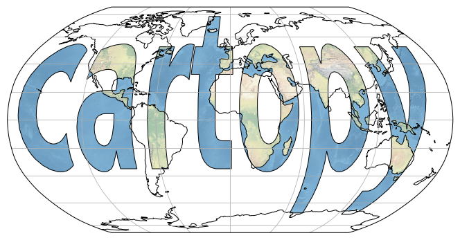


### Regridding vectors with quiver


```python
"""
Regridding vectors with quiver
------------------------------

This example demonstrates the regridding functionality in quiver (there exists
equivalent functionality in :meth:`cartopy.mpl.geoaxes.GeoAxes.barbs`).

Regridding can be an effective way of visualising a vector field, particularly
if the data is dense or warped.
"""
import matplotlib.pyplot as plt
import numpy as np

import cartopy.crs as ccrs


def sample_data(shape=(20, 30)):
    """
    Returns ``(x, y, u, v, crs)`` of some vector data
    computed mathematically. The returned CRS will be a North Polar
    Stereographic projection, meaning that the vectors will be unevenly
    spaced in a PlateCarree projection.

    """
    crs = ccrs.NorthPolarStereo()
    scale = 1e7
    x = np.linspace(-scale, scale, shape[1])
    y = np.linspace(-scale, scale, shape[0])

    x2d, y2d = np.meshgrid(x, y)
    u = 10 * np.cos(2 * x2d / scale + 3 * y2d / scale)
    v = 20 * np.cos(6 * x2d / scale)

    return x, y, u, v, crs


def main():
    plt.figure(figsize=(8, 10))

    x, y, u, v, vector_crs = sample_data(shape=(50, 50))
    ax1 = plt.subplot(2, 1, 1, projection=ccrs.PlateCarree())
    ax1.coastlines('50m')
    ax1.set_extent([-45, 55, 20, 80], ccrs.PlateCarree())
    ax1.quiver(x, y, u, v, transform=vector_crs)

    ax2 = plt.subplot(2, 1, 2, projection=ccrs.PlateCarree())
    plt.title('The same vector field regridded')
    ax2.coastlines('50m')
    ax2.set_extent([-45, 55, 20, 80], ccrs.PlateCarree())
    ax2.quiver(x, y, u, v, transform=vector_crs, regrid_shape=20)

    plt.show()


if __name__ == '__main__':
    main()
```


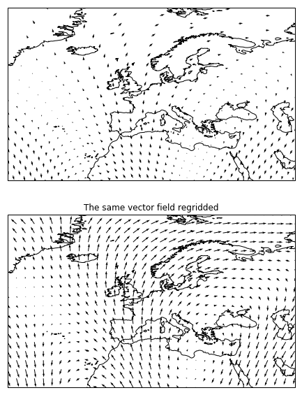


### reprojected_wmts example


```python
"""
Displaying WMTS tiled map data on an arbitrary projection
---------------------------------------------------------

This example displays imagery from a web map tile service on two different
projections, one of which is not provided by the service.

This result can also be interactively panned and zoomed.

The example WMTS layer is a single composite of data sampled over nine days
in April 2012 and thirteen days in October 2012 showing the Earth at night.
It does not vary over time.

The imagery was collected by the Suomi National Polar-orbiting Partnership
(Suomi NPP) weather satellite operated by the United States National Oceanic
and Atmospheric Administration (NOAA).

"""

import matplotlib.pyplot as plt
import cartopy.crs as ccrs


def plot_city_lights():
    # Define resource for the NASA night-time illumination data.
    base_uri = 'http://map1c.vis.earthdata.nasa.gov/wmts-geo/wmts.cgi'
    layer_name = 'VIIRS_CityLights_2012'

    # Create a Cartopy crs for plain and rotated lat-lon projections.
    plain_crs = ccrs.PlateCarree()
    rotated_crs = ccrs.RotatedPole(pole_longitude=120.0, pole_latitude=45.0)

    # Plot WMTS data in a specific region, over a plain lat-lon map.
    ax = plt.subplot(121, projection=plain_crs)
    ax.set_extent((-6, 3, 48, 58), crs=ccrs.PlateCarree())
    ax.coastlines(resolution='50m', color='yellow')
    ax.gridlines(color='lightgrey', linestyle='-')
    # Add WMTS imaging.
    ax.add_wmts(base_uri, layer_name=layer_name)

    # Plot WMTS data on a rotated map, over the same nominal region.
    ax = plt.subplot(122, projection=rotated_crs)
    ax.set_extent((-6, 3, 48, 58), crs=plain_crs)
    ax.coastlines(resolution='50m', color='yellow')
    ax.gridlines(color='lightgrey', linestyle='-')
    # Add WMTS imaging.
    ax.add_wmts(base_uri, layer_name=layer_name)

    plt.show()


if __name__ == '__main__':
    plot_city_lights()
```


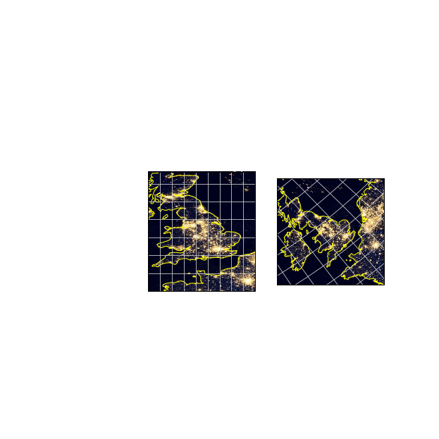


### Rotated pole boxes

This example demonstrates the way a box is warped when it is defined in a rotated pole coordinate system.

Try changing the box_top to 44, 46 and 75 to see the effect that including the pole in the polygon has.


```python
"""
Rotated pole boxes
------------------

This example demonstrates the way a box is warped when it is defined
in a rotated pole coordinate system.

Try changing the ``box_top`` to ``44``, ``46`` and ``75`` to see the effect
that including the pole in the polygon has.

"""

import matplotlib.pyplot as plt

import cartopy.crs as ccrs


def main():
    fig = plt.figure(figsize=(8,15))
    rotated_pole = ccrs.RotatedPole(pole_latitude=45, pole_longitude=180)

    box_top = 45
    x, y = [-44, -44, 45, 45, -44], [-45, box_top, box_top, -45, -45]

    ax = plt.subplot(211, projection=rotated_pole)
    ax.stock_img()
    ax.coastlines()
    ax.plot(x, y, marker='o', transform=rotated_pole)
    ax.fill(x, y, color='coral', transform=rotated_pole, alpha=0.4)
    ax.gridlines()

    ax = plt.subplot(212, projection=ccrs.PlateCarree())
    ax.stock_img()
    ax.coastlines()
    ax.plot(x, y, marker='o', transform=rotated_pole)
    ax.fill(x, y, transform=rotated_pole, color='coral', alpha=0.4)
    ax.gridlines()

    plt.show()


if __name__ == '__main__':
    main()
```


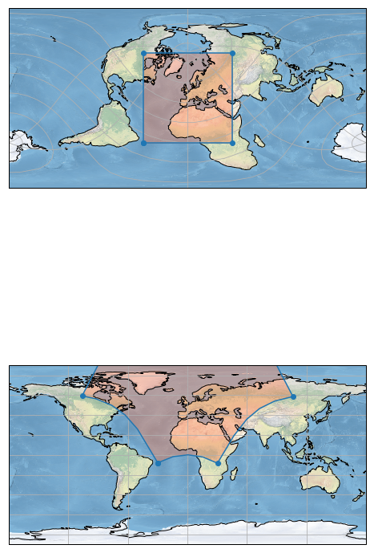


### Modifying the boundary/neatline of a map in cartopy

This example demonstrates how to modify the boundary/neatline of an axes. We construct a star with coordinates in a Plate Carree coordinate system, and use the star as the outline of the map.

Notice how changing the projection of the map represents a projected star shaped boundary.


```python
"""
Modifying the boundary/neatline of a map in cartopy
---------------------------------------------------

This example demonstrates how to modify the boundary/neatline
of an axes. We construct a star with coordinates in a Plate Carree
coordinate system, and use the star as the outline of the map.

Notice how changing the projection of the map represents a *projected*
star shaped boundary.

"""
import matplotlib.path as mpath
import matplotlib.pyplot as plt

import cartopy.crs as ccrs


def main():
    ax = plt.axes([0, 0, 1, 1], projection=ccrs.PlateCarree())
    ax.coastlines()

    # Construct a star in longitudes and latitudes.
    star_path = mpath.Path.unit_regular_star(5, 0.5)
    star_path = mpath.Path(star_path.vertices.copy() * 80,
                           star_path.codes.copy())

    # Use the star as the boundary.
    ax.set_boundary(star_path, transform=ccrs.PlateCarree())

    plt.show()


if __name__ == '__main__':
    main()
```


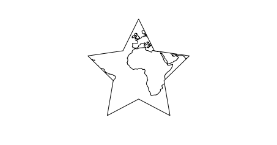


### streamplot example


```python
import matplotlib.pyplot as plt

import cartopy.crs as ccrs
from cartopy.examples.arrows import sample_data


def main():
    ax = plt.axes(projection=ccrs.PlateCarree())
    ax.set_extent([-90, 75, 10, 60])
    ax.coastlines()

    x, y, u, v, vector_crs = sample_data(shape=(80, 100))
    magnitude = (u ** 2 + v ** 2) ** 0.5
    ax.streamplot(x, y, u, v, transform=vector_crs,
                  linewidth=2, density=2, color=magnitude)
    plt.show()


if __name__ == '__main__':
    main()
```


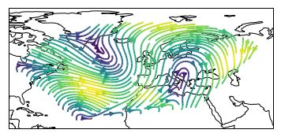


### tick_labels example


```python
"""
This example demonstrates adding tick labels to maps on rectangular
projections using special tick formatters.

"""
import cartopy.crs as ccrs
from cartopy.mpl.ticker import LongitudeFormatter, LatitudeFormatter
import matplotlib.pyplot as plt


def main():
    plt.figure(figsize=(8, 10))

    # Label axes of a Plate Carree projection with a central longitude of 180:
    ax1 = plt.subplot(211, projection=ccrs.PlateCarree(central_longitude=180))
    ax1.set_global()
    ax1.coastlines()
    ax1.set_xticks([0, 60, 120, 180, 240, 300, 360], crs=ccrs.PlateCarree())
    ax1.set_yticks([-90, -60, -30, 0, 30, 60, 90], crs=ccrs.PlateCarree())
    lon_formatter = LongitudeFormatter(zero_direction_label=True)
    lat_formatter = LatitudeFormatter()
    ax1.xaxis.set_major_formatter(lon_formatter)
    ax1.yaxis.set_major_formatter(lat_formatter)

    # Label axes of a Mercator projection without degree symbols in the labels
    # and formatting labels to include 1 decimal place:
    ax2 = plt.subplot(212, projection=ccrs.Mercator())
    ax2.set_global()
    ax2.coastlines()
    ax2.set_xticks([-180, -120, -60, 0, 60, 120, 180], crs=ccrs.PlateCarree())
    ax2.set_yticks([-78.5, -60, -25.5, 25.5, 60, 80], crs=ccrs.PlateCarree())
    lon_formatter = LongitudeFormatter(number_format='.1f',
                                       degree_symbol='',
                                       dateline_direction_label=True)
    lat_formatter = LatitudeFormatter(number_format='.1f',
                                      degree_symbol='')
    ax2.xaxis.set_major_formatter(lon_formatter)
    ax2.yaxis.set_major_formatter(lat_formatter)

    plt.show()


if __name__ == '__main__':
    main()
```


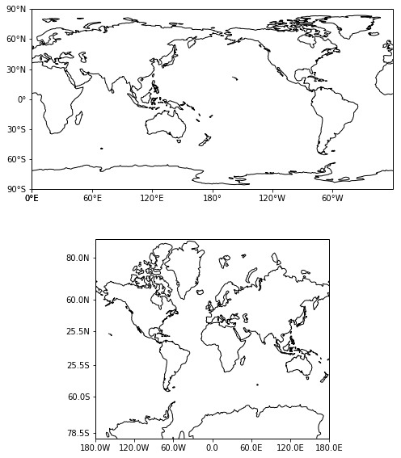


### tissot example


```python
import matplotlib.pyplot as plt

import cartopy.crs as ccrs


def main():
    plt.figure(figsize=(10, 20))
    ax = plt.axes(projection=ccrs.PlateCarree())

    # make the map global rather than have it zoom in to
    # the extents of any plotted data
    ax.set_global()

    ax.stock_img()
    ax.coastlines()

    ax.tissot(facecolor='orange', alpha=0.4)

    plt.show()


if __name__ == '__main__':
    main()
```

    /home/ding/anaconda3/lib/python3.6/site-packages/cartopy/mpl/geoaxes.py:598: UserWarning: Approximating coordinate system <cartopy._crs.Geodetic object at 0x7f9be39500f8> with the PlateCarree projection.
      'PlateCarree projection.'.format(crs))


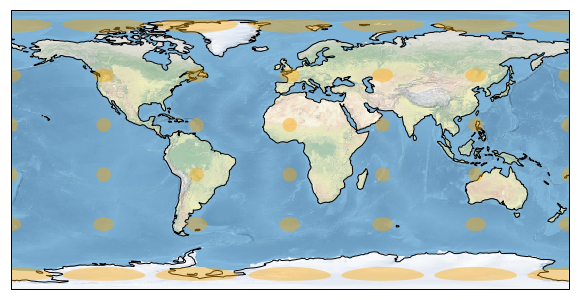


### tube_stations example


```python
"""
Produces a map showing London Underground station locations with high
resolution background imagery provided by OpenStreetMap.

"""
from matplotlib.path import Path
import matplotlib.pyplot as plt
import numpy as np

import cartopy.crs as ccrs
from cartopy.io.img_tiles import OSM


def tube_locations():
    """
    Returns an (n, 2) array of selected London Tube locations in Ordnance
    Survey GB coordinates.

    Source: http://www.doogal.co.uk/london_stations.php

    """
    return np.array([[531738., 180890.], [532379., 179734.],
                     [531096., 181642.], [530234., 180492.],
                     [531688., 181150.], [530242., 180982.],
                     [531940., 179144.], [530406., 180380.],
                     [529012., 180283.], [530553., 181488.],
                     [531165., 179489.], [529987., 180812.],
                     [532347., 180962.], [529102., 181227.],
                     [529612., 180625.], [531566., 180025.],
                     [529629., 179503.], [532105., 181261.],
                     [530995., 180810.], [529774., 181354.],
                     [528941., 179131.], [531050., 179933.],
                     [530240., 179718.]])


def main():
    imagery = OSM()
    plt.figure(figsize=(8, 10))
    ax = plt.axes(projection=imagery.crs)
    ax.set_extent((-0.14, -0.1, 51.495, 51.515))

    # Construct concentric circles and a rectangle,
    # suitable for a London Underground logo.
    theta = np.linspace(0, 2 * np.pi, 100)
    circle_verts = np.vstack([np.sin(theta), np.cos(theta)]).T
    concentric_circle = Path.make_compound_path(Path(circle_verts[::-1]),
                                                Path(circle_verts * 0.6))

    rectangle = Path([[-1.1, -0.2], [1, -0.2], [1, 0.3], [-1.1, 0.3]])

    # Add the imagery to the map.
    ax.add_image(imagery, 14)

    # Plot the locations twice, first with the red concentric circles,
    # then with the blue rectangle.
    xs, ys = tube_locations().T
    plt.plot(xs, ys, transform=ccrs.OSGB(),
             marker=concentric_circle, color='green', markersize=9,
             linestyle='')
    plt.plot(xs, ys, transform=ccrs.OSGB(),
             marker=rectangle, color='yellow', markersize=11,
             linestyle='')

    plt.title('London underground locations')
    plt.show()


if __name__ == '__main__':
    main()
```


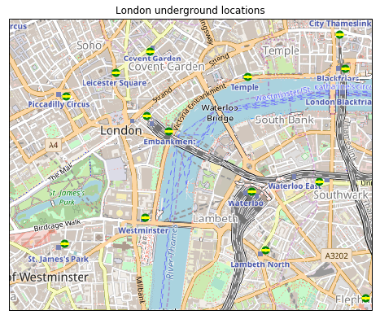


### un_flag example


```python
import cartopy.crs as ccrs
import cartopy.feature
import matplotlib.pyplot as plt
from matplotlib.patches import PathPatch
import matplotlib.path
import matplotlib.ticker
from matplotlib.transforms import BboxTransform, Bbox
import numpy as np


# When drawing the flag, we can either use white filled land, or be a little
# more fancy and use the Natural Earth shaded relief imagery.
filled_land = True


def olive_path():
    """
    Returns a matplotlib path representing a single olive branch from the
    UN Flag. The path coordinates were extracted from the SVG at
    https://commons.wikimedia.org/wiki/File:Flag_of_the_United_Nations.svg.

    """
    olives_verts = np.array(
        [[0,   2,   6,   9,  30,  55,  79,  94, 104, 117, 134, 157, 177,
          188, 199, 207, 191, 167, 149, 129, 109,  87,  53,  22,   0, 663,
          245, 223, 187, 158, 154, 150, 146, 149, 154, 158, 181, 184, 197,
          181, 167, 153, 142, 129, 116, 119, 123, 127, 151, 178, 203, 220,
          237, 245, 663, 280, 267, 232, 209, 205, 201, 196, 196, 201, 207,
          211, 224, 219, 230, 220, 212, 207, 198, 195, 176, 197, 220, 239,
          259, 277, 280, 663, 295, 293, 264, 250, 247, 244, 240, 240, 243,
          244, 249, 251, 250, 248, 242, 245, 233, 236, 230, 228, 224, 222,
          234, 249, 262, 275, 285, 291, 295, 296, 295, 663, 294, 293, 292,
          289, 294, 277, 271, 269, 268, 265, 264, 264, 264, 272, 260, 248,
          245, 243, 242, 240, 243, 245, 247, 252, 256, 259, 258, 257, 258,
          267, 285, 290, 294, 297, 294, 663, 285, 285, 277, 266, 265, 265,
          265, 277, 266, 268, 269, 269, 269, 268, 268, 267, 267, 264, 248,
          235, 232, 229, 228, 229, 232, 236, 246, 266, 269, 271, 285, 285,
          663, 252, 245, 238, 230, 246, 245, 250, 252, 255, 256, 256, 253,
          249, 242, 231, 214, 208, 208, 227, 244, 252, 258, 262, 262, 261,
          262, 264, 265, 252, 663, 185, 197, 206, 215, 223, 233, 242, 237,
          237, 230, 220, 202, 185, 663],
         [8,   5,   3,   0,  22,  46,  46,  46,  35,  27,  16,  10,  18,
          22,  28,  38,  27,  26,  33,  41,  52,  52,  52,  30,   8, 595,
          77,  52,  61,  54,  53,  52,  53,  55,  55,  57,  65,  90, 106,
          96,  81,  68,  58,  54,  51,  50,  51,  50,  44,  34,  43,  48,
          61,  77, 595, 135, 104, 102,  83,  79,  76,  74,  74,  79,  84,
          90, 109, 135, 156, 145, 133, 121, 100,  77,  62,  69,  67,  80,
          92, 113, 135, 595, 198, 171, 156, 134, 129, 124, 120, 123, 126,
          129, 138, 149, 161, 175, 188, 202, 177, 144, 116, 110, 105,  99,
          108, 116, 126, 136, 147, 162, 173, 186, 198, 595, 249, 255, 261,
          267, 241, 222, 200, 192, 183, 175, 175, 175, 175, 199, 221, 240,
          245, 250, 256, 245, 233, 222, 207, 194, 180, 172, 162, 153, 154,
          171, 184, 202, 216, 233, 249, 595, 276, 296, 312, 327, 327, 327,
          327, 308, 284, 262, 240, 240, 239, 239, 242, 244, 247, 265, 277,
          290, 293, 296, 300, 291, 282, 274, 253, 236, 213, 235, 252, 276,
          595, 342, 349, 355, 357, 346, 326, 309, 303, 297, 291, 290, 297,
          304, 310, 321, 327, 343, 321, 305, 292, 286, 278, 270, 276, 281,
          287, 306, 328, 342, 595, 379, 369, 355, 343, 333, 326, 318, 328,
          340, 349, 366, 373, 379, 595]]).T
    olives_codes = np.array([1, 4, 4, 4, 4, 4, 4, 4, 4, 4, 4, 4, 4, 4, 4, 4,
                             4, 4, 4, 4, 4, 4, 4, 4, 4, 79, 1, 4, 4, 4, 4, 4,
                             4, 4, 4, 4, 4, 4, 4, 4, 4, 4, 4, 4, 4, 4, 4, 4,
                             4, 4, 4, 4, 4, 4, 79, 1, 4, 4, 4, 4, 4, 4, 2, 4,
                             4, 4, 4, 4, 4, 4, 4, 4, 4, 4, 4, 4, 4, 4, 4, 4,
                             4, 79, 1, 4, 4, 4, 4, 4, 4, 4, 4, 4, 4, 4, 4, 4,
                             4, 4, 4, 4, 4, 4, 4, 4, 4, 4, 4, 4, 4, 4, 4, 4,
                             4, 79, 1, 4, 4, 4, 4, 4, 4, 4, 4, 4, 4, 4, 4, 4,
                             4, 4, 4, 4, 4, 4, 4, 4, 4, 4, 4, 4, 4, 4, 2, 4,
                             4, 4, 4, 4, 4, 79, 1, 4, 4, 4, 4, 4, 4, 4, 4, 4,
                             2, 4, 4, 4, 4, 4, 4, 4, 4, 4, 4, 4, 4, 4, 4, 4,
                             4, 4, 4, 4, 4, 4, 79, 1, 4, 4, 4, 4, 4, 4, 4, 4,
                             4, 2, 4, 4, 4, 4, 4, 4, 4, 4, 4, 4, 4, 4, 4, 4,
                             4, 4, 4, 4, 79, 1, 4, 4, 4, 4, 4, 4, 4, 4, 4, 4,
                             4, 4, 79], dtype=np.uint8)

    return matplotlib.path.Path(olives_verts, olives_codes)


def main():
    blue = '#4b92db'

    # We're drawing a flag with a 3:5 aspect ratio.
    fig = plt.figure(figsize=[10, 6], facecolor=blue)
    # Put a blue background on the figure.
    blue_background = PathPatch(matplotlib.path.Path.unit_rectangle(),
                                transform=fig.transFigure, color=blue,
                                zorder=-1)
    fig.patches.append(blue_background)

    # Set up the Azimuthal Equidistant and Plate Carree projections
    # for later use.
    az_eq = ccrs.AzimuthalEquidistant(central_latitude=90)
    pc = ccrs.PlateCarree()

    # Pick a suitable location for the map (which is in an Azimuthal
    # Equidistant projection).
    ax = plt.axes([0.25, 0.24, 0.5, 0.54], projection=az_eq)

    # The background patch and outline patch are not needed in this example.
    ax.background_patch.set_facecolor('none')
    ax.outline_patch.set_edgecolor('none')

    # We want the map to go down to -60 degrees latitude.
    ax.set_extent([-180, 180, -60, 90], ccrs.PlateCarree())

    # Importantly, we want the axes to be circular at the -60 latitude
    # rather than cartopy's default behaviour of zooming in and becoming
    # square.
    _, patch_radius = az_eq.transform_point(0, -60, pc)
    circular_path = matplotlib.path.Path.circle(0, patch_radius)
    ax.set_boundary(circular_path)

    if filled_land:
        ax.add_feature(
            cartopy.feature.LAND, facecolor='white', edgecolor='none')
    else:
        ax.stock_img()

    gl = ax.gridlines(crs=pc, linewidth=3, color='white', linestyle='-')
    # Meridians every 45 degrees, and 5 parallels.
    gl.xlocator = matplotlib.ticker.FixedLocator(np.arange(0, 361, 45))
    parallels = np.linspace(-60, 70, 5, endpoint=True)
    gl.ylocator = matplotlib.ticker.FixedLocator(parallels)

    # Now add the olive branches around the axes. We do this in normalised
    # figure coordinates
    olive_leaf = olive_path()

    olives_bbox = Bbox.null()
    olives_bbox.update_from_path(olive_leaf)

    # The first olive branch goes from left to right.
    olive1_axes_bbox = Bbox([[0.45, 0.15], [0.725, 0.75]])
    olive1_trans = BboxTransform(olives_bbox, olive1_axes_bbox)

    # THe second olive branch goes from right to left (mirroring the first).
    olive2_axes_bbox = Bbox([[0.55, 0.15], [0.275, 0.75]])
    olive2_trans = BboxTransform(olives_bbox, olive2_axes_bbox)

    olive1 = PathPatch(olive_leaf, facecolor='white', edgecolor='none',
                       transform=olive1_trans + fig.transFigure)
    olive2 = PathPatch(olive_leaf, facecolor='white', edgecolor='none',
                       transform=olive2_trans + fig.transFigure)

    fig.patches.append(olive1)
    fig.patches.append(olive2)

    plt.show()


if __name__ == '__main__':
    main()
```


### waves example


```python
import matplotlib.pyplot as plt
import numpy as np

import cartopy.crs as ccrs


def sample_data(shape=(73, 145)):
    """Returns ``lons``, ``lats`` and ``data`` of some fake data."""
    nlats, nlons = shape
    lats = np.linspace(-np.pi / 2, np.pi / 2, nlats)
    lons = np.linspace(0, 2 * np.pi, nlons)
    lons, lats = np.meshgrid(lons, lats)
    wave = 0.75 * (np.sin(2 * lats) ** 8) * np.cos(4 * lons)
    mean = 0.5 * np.cos(2 * lats) * ((np.sin(2 * lats)) ** 2 + 2)

    lats = np.rad2deg(lats)
    lons = np.rad2deg(lons)
    data = wave + mean

    return lons, lats, data


def main():
    ax = plt.axes(projection=ccrs.Mollweide())

    lons, lats, data = sample_data()

    ax.contourf(lons, lats, data,
                transform=ccrs.PlateCarree(),
                cmap='spectral')
    ax.coastlines()
    ax.set_global()
    plt.show()


if __name__ == '__main__':
    main()
```

    /home/ding/anaconda3/lib/python3.6/site-packages/matplotlib/cbook.py:136: MatplotlibDeprecationWarning: The spectral and spectral_r colormap was deprecated in version 2.0. Use nipy_spectral and nipy_spectral_r instead.
      warnings.warn(message, mplDeprecation, stacklevel=1)


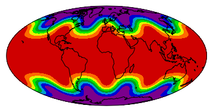


### wms example


```python
"""
Interactive WMS (Web Map Service)
---------------------------------

This example demonstrates the interactive pan and zoom capability
supported by an OGC web services Web Map Service (WMS) aware axes.

"""
import cartopy.crs as ccrs
import matplotlib.pyplot as plt


def main():
    ax = plt.axes(projection=ccrs.InterruptedGoodeHomolosine())
    ax.coastlines()

    ax.add_wms(wms='http://vmap0.tiles.osgeo.org/wms/vmap0',
               layers=['basic'])

    plt.show()


if __name__ == '__main__':
    main()
```


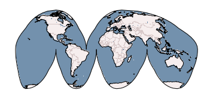


### wmts example


```python
"""
Interactive WMTS (Web Map Tile Service)
---------------------------------------

This example demonstrates the interactive pan and zoom capability
supported by an OGC web services Web Map Tile Service (WMTS) aware axes.

The example WMTS layer is a single composite of data sampled over nine days
in April 2012 and thirteen days in October 2012 showing the Earth at night.
It does not vary over time.

The imagery was collected by the Suomi National Polar-orbiting Partnership
(Suomi NPP) weather satellite operated by the United States National Oceanic
and Atmospheric Administration (NOAA).

"""

import cartopy.crs as ccrs
import matplotlib.pyplot as plt


def main():
    url = 'https://map1c.vis.earthdata.nasa.gov/wmts-geo/wmts.cgi'
    layer = 'VIIRS_CityLights_2012'

    ax = plt.axes(projection=ccrs.PlateCarree())
    ax.add_wmts(url, layer)
    ax.set_extent((-15, 25, 35, 60))

    plt.title('Suomi NPP Earth at night April/October 2012')
    plt.show()


if __name__ == '__main__':
    main()
```


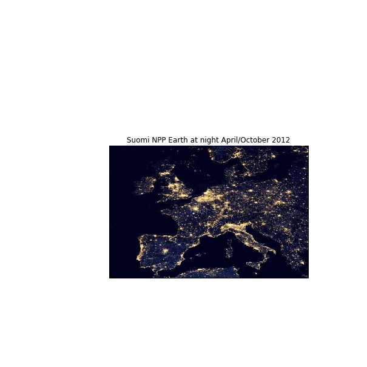


### wmts_time example


```python
"""
Web Map Tile Service time dimension demonstration
-------------------------------------------------

This example further demonstrates WMTS support within cartopy. Optional
keyword arguments can be supplied to the OGC WMTS 'gettile' method. This
allows for the specification of the 'time' dimension for a WMTS layer
which supports it.

The example shows satellite imagery retrieved from NASA's Global Imagery
Browse Services for 5th Feb 2016. A true color MODIS image is shown on
the left, with the MODIS false color 'snow RGB' shown on the right.

"""
import matplotlib.pyplot as plt
import matplotlib.patheffects as PathEffects
import cartopy.crs as ccrs
from owslib.wmts import WebMapTileService


def main():
    # URL of NASA GIBS
    URL = 'https://gist.github.com/pelson/5871263/raw/'
           'EIDA50_201211061300_clip2.png'
    wmts = WebMapTileService(URL)

    # Layers for MODIS true color and snow RGB
    layers = ['MODIS_Terra_SurfaceReflectance_Bands143',
              'MODIS_Terra_CorrectedReflectance_Bands367']

    date_str = '2016-02-05'

    # Plot setup
    plot_CRS = ccrs.Mercator()
    geodetic_CRS = ccrs.Geodetic()
    x0, y0 = plot_CRS.transform_point(4.6, 43.1, geodetic_CRS)
    x1, y1 = plot_CRS.transform_point(11.0, 47.4, geodetic_CRS)
    ysize = 8
    xsize = 2 * ysize * (x1 - x0) / (y1 - y0)
    fig = plt.figure(figsize=(xsize, ysize), dpi=100)

    for layer, offset in zip(layers, [0, 0.5]):
        ax = plt.axes([offset, 0, 0.5, 1], projection=plot_CRS)
        ax.set_xlim((x0, x1))
        ax.set_ylim((y0, y1))
        ax.add_wmts(wmts, layer, wmts_kwargs={'time': date_str})
        txt = plt.text(4.7, 43.2, wmts[layer].title, fontsize=18,
                       color='wheat', transform=geodetic_CRS)
        txt.set_path_effects([PathEffects.withStroke(linewidth=5,
                                                     foreground='black')])
    plt.show()


if __name__ == '__main__':
    main()
```

    IOPub data rate exceeded.
    The notebook server will temporarily stop sending output
    to the client in order to avoid crashing it.
    To change this limit, set the config variable
    `--NotebookApp.iopub_data_rate_limit`.


```python

```
